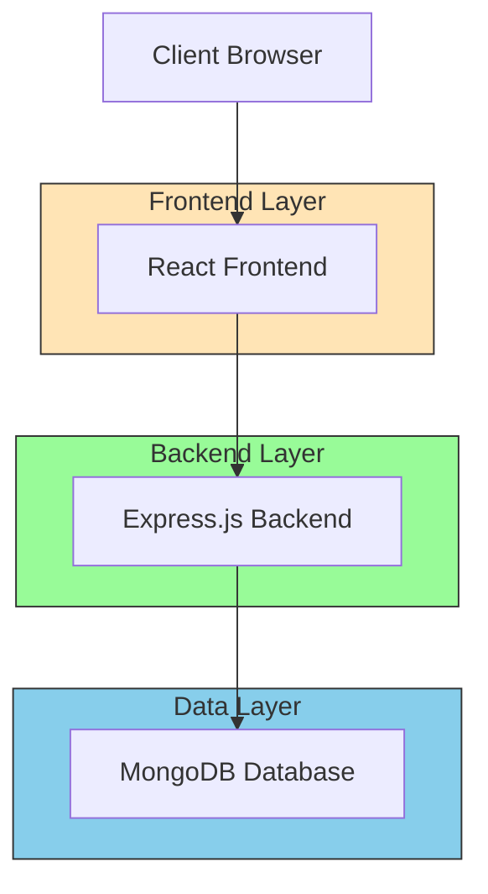
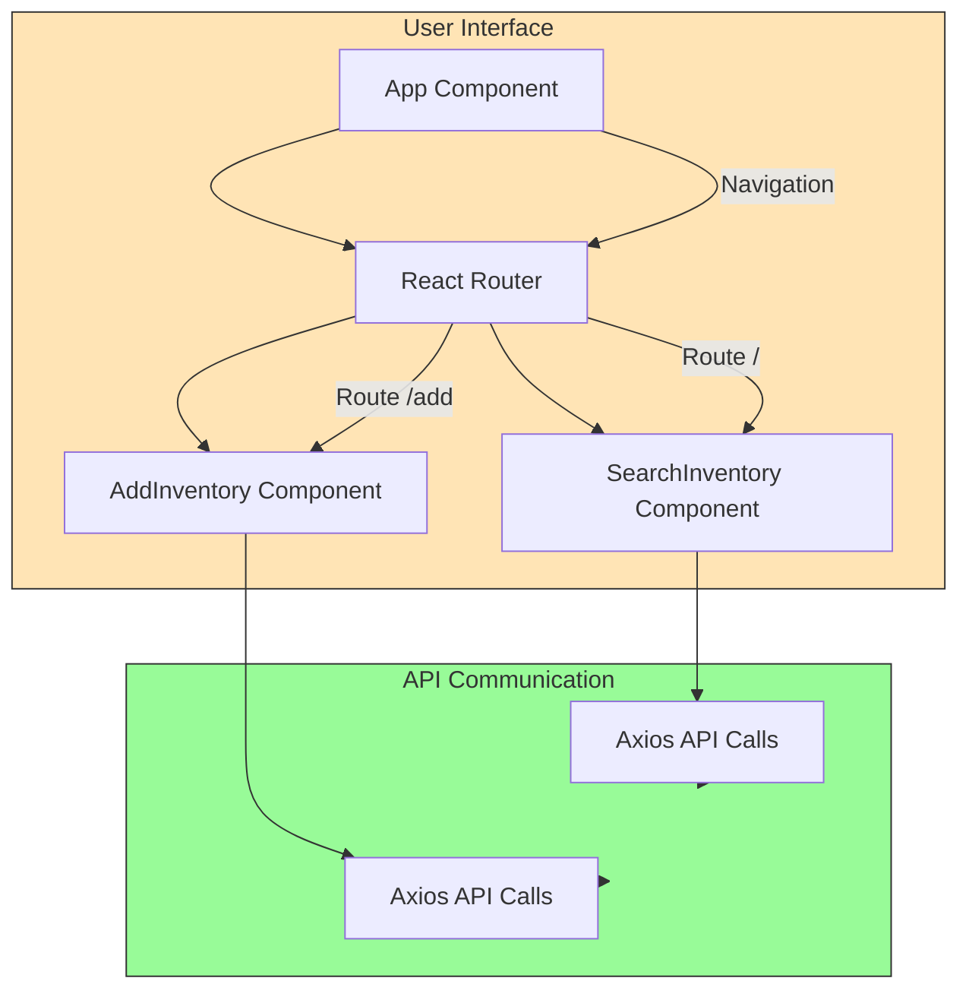
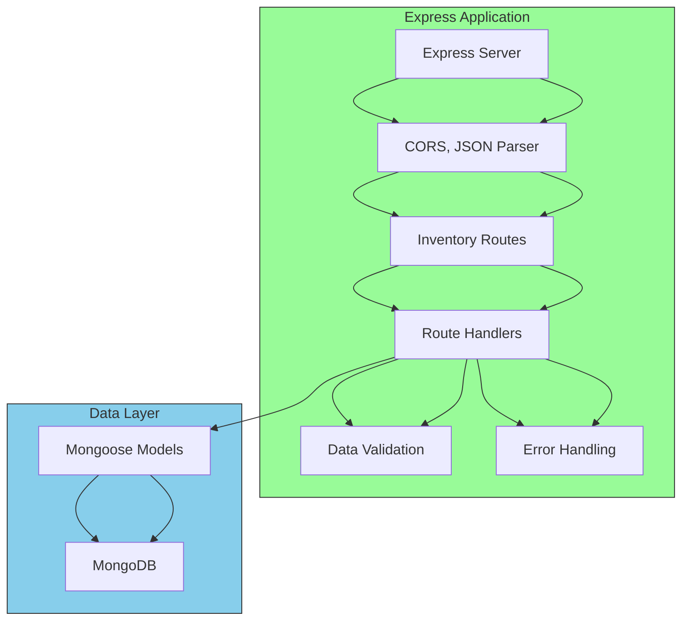

# Inventory Management System - Architecture

## System Overview
The Inventory Management System is a full-stack web application designed for internal inventory tracking at zone24x7. It consists of a React frontend and a Node.js/Express backend with MongoDB as the database.

## Architecture Diagram



## Component Architecture

### Frontend Components


### Backend Components


## Data Flow

```mermaid
sequenceDiagram
    participant User
    participant Frontend
    participant Backend
    participant Database
    
    User->>Frontend: Interacts with UI
    Frontend->>Backend: HTTP API Request
    Backend->>Database: Database Query
    Database-->>Backend: Data Response
    Backend-->>Frontend: API Response
    Frontend-->>User: Updated UI